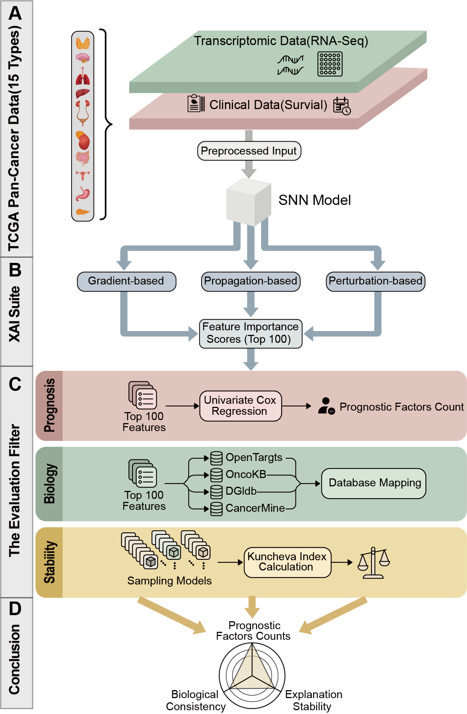

# XAI-Cancer-Survival
A Systematic Evaluation Framework for Explainable AI (XAI) in Deep Learning-based Cancer Survival Prediction

### 📖 Introduction
This project provides a systematic evaluation framework to assess the performance of various Explainable AI (XAI) methods within the context of cancer survival prediction. Utilizing transcriptome data from 15 major cancer types in The Cancer Genome Atlas (TCGA), we constructed Self-Normalizing Neural Network (SNN) models and performed a comparative analysis across six core XAI algorithms.

### 🔄 Workflow
An overview of the proposed XAI evaluation framework. Transcriptomic and clinical data from TCGA are used to train SNN models. Multiple XAI methods are applied to derive feature importance, followed by systematic evaluation from biological plausibility, prognostic significance, and stability.

*Figure 1. Overview of the proposed XAI evaluation framework.*

### 🧪 Core Features
15 Cancer Types: 'COADREAD', 'LUSC', 'HNSC', 'STAD', 'BLCA', 'BRCA', 'LUAD', 'PAAD', 'LIHC', 'SKCM', 'KIRC', 'UCEC', 'KIRP', 'GBMLGG', 'LGG'.  

6 XAI Methods:
Integrated Gradients (IG)
GradientSHAP
DeepSHAP (A unified approach combining DeepLIFT and SHAP)
DeepLIFT
Layer-wise Relevance Propagation (LRP)
Permutation Feature Importance (PFI)
Evaluation Metrics: Biological consistency, prognostic factor enrichment analysis, and stability assessment.

### 📁 Project Structure
datasets_csv/: Data preprocessing scripts (feature selection, sample splitting, etc.).
operation/: Core XAI evaluation algorithms and Bootstrap validation scripts.
biological_plausibility/: Scripts for biological functional validation and visualization logic.

🚀 Quick Start
1. Environment Setup
Ensure you have Python installed, then install the required dependencies:
`pip install -r requirements.txt`
2. Execution commands
`export TCGA_DIR=/path/to/TCGA`
All scripts can be executed using the commands listed in `command.sh`
